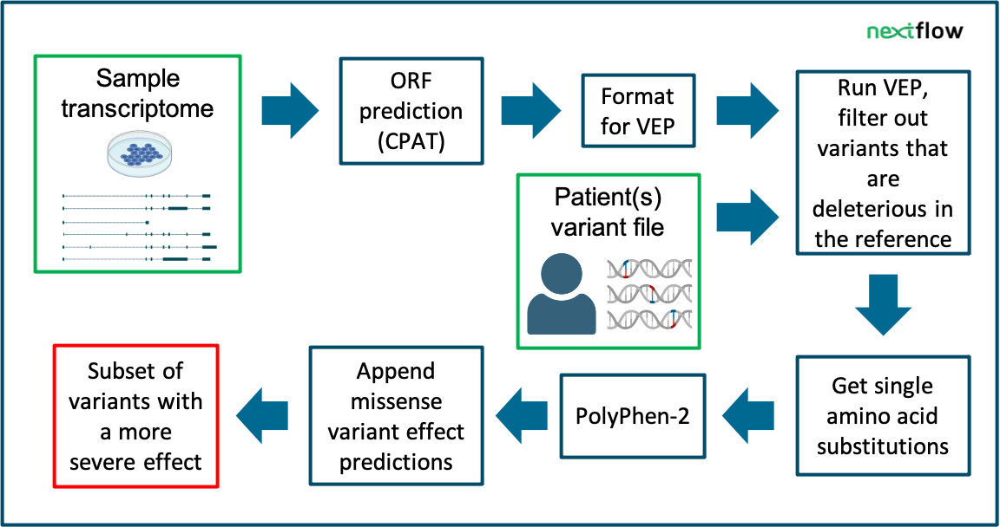

# SUsPECT: Solving Unsolved Patient Exomes using a Custom Transcriptome


Variant effect prediction based on custom long-read transcriptomes improves clinical variant annotation


## Description:

 Long-read transcriptomes often contain lots of novelty- especially in samples containing less well-studied tissues/conditions. This has implications for variant effect predictions. Variant effects may change with new or updated transcript annotations. This Nextflow pipeline runs VEP using your transcript file and appends missense effect predictions. The output may help expose potentially disease-causing variants that were previously overlooked.



## Installation:

Running the pipeline requires:
 - [Nextflow](https://www.nextflow.io)
 - [Polyphen-2 data](http://genetics.bwh.harvard.edu/pph2/dokuwiki/downloads)
 - [VEP cache](https://www.ensembl.org/info/docs/tools/vep/script/vep_cache.html)
 - [Singularity](https://sylabs.io/singularity/)

### Installing Nextflow
In a terminal, use the command ```java -version``` to check that you have Java >= 11. Then run ```curl -s https://get.nextflow.io | bash``` in the directory that you would like nextflow installed in.

### Installing Polyphen-2 data
For installation of Polyphen-2 data, we have made a bash script that you can run in the directory where you want the data to be located. Do bear in mind that the size of the data exceeds 300GB. In a terminal, run the command below in the directory where you would like your data installed:
```sh download_pph2_data.sh```
Give the path to this directory as input for SUsPECT (e.g. --polyphen2_data $HOME/polyphen-2.2.2/)

### Installing the VEP cache
For hg38, run the following in a terminal in the directory (e.g. $HOME/.vep) where you would like the VEP cache installed:
```curl -O https://ftp.ensembl.org/pub/release-109/variation/indexed_vep_cache/homo_sapiens_merged_vep_109_GRCh38.tar.gz```
Give the path to this directory as input for SUsPECT (e.g. --vep_dir_cache $HOME/.vep)

### Installing singularity
On a linux machine run the following 3 commands:
```
sudo apt-get update && sudo apt-get install -y \
    build-essential \
    uuid-dev \
    libgpgme-dev \
    squashfs-tools \
    libseccomp-dev \
    wget \
    pkg-config \
    git \
    cryptsetup-bin
    
wget https://go.dev/dl/go1.20.2.linux-amd64.tar.gz && \
    sudo tar -C /usr/local -xzvf go1.20.2.linux-amd64.tar.gz && \
    rm go1.20.2.linux-amd64.tar.gz
    
echo 'export GOPATH=${HOME}/go' >> ~/.bashrc && \
    echo 'export PATH=/usr/local/go/bin:${PATH}:${GOPATH}/bin' >> ~/.bashrc && \
    source ~/.bashrc
```
for other platforms, please consult https://docs.sylabs.io/guides/3.5/admin-guide/installation.html.

### Installing files for ORF prediction
Click [this](https://sourceforge.net/projects/rna-cpat/files/v1.2.2/prebuilt_model/Human_Hexamer.tsv/download) and [this](https://sourceforge.net/projects/rna-cpat/files/v1.2.2/prebuilt_model/Human_logitModel.RData/download).
Supply the path to the Human_logitModel.RData file with the ```--logit_model``` parameter and the path to Human_Hexamer.tsv file with the ```--hexamer``` parameter.
More information about how these files help with ORF prediction can be found [here](https://cpat.readthedocs.io/en/latest/).


## Input:

The input for this pipeline is a patient (combined) VCF and a long-read transcriptome. 

The files needed include:
- transcript structures in GTF format. TALON or IsoQuant outputs are supported (more details below)
- a genome FASTA file (bgzipped)
- a VCF file of patient(s)
- Human_logitModel.RData & Human_Hexamer.tsv from https://sourceforge.net/projects/rna-cpat/files/v1.2.2/prebuilt_model/

If you have multiple patients over multiple VCF files, please combine them into one VCF file with [vcftools](https://vcftools.github.io/perl_module.html#vcf-merge).

If your VCF file has 'chr' in front of the chromosome numbers (e.g. chr1, chr 2, etc), they need to be converted to ENSEMBL format. This can be done by downloading the converter file [here](https://github.com/dpryan79/ChromosomeMappings/blob/master/GRCh38_gencode2ensembl.txt) and running the following on your VCF file:
```
bcftools annotate --rename-chrs GRCh38_gencode2ensembl.txt -o chr_renamed.vcf -O v original.vcf
bgzip chr_renamed.vcf
tabix -p vcf chr_renamed.vcf.gz
```

## How to run:

### Perform TALON or IsoQuant analysis

The long-read transcriptome should either be processed with [TALON](https://github.com/mortazavilab/TALON) or [IsoQuant](https://github.com/ablab/IsoQuant) before running this pipeline. 

For TALON: The gtf file output from the ```talon_create_GTF``` step should be given to --talon_gtf input parameter.

For IsoQuant: The gtf file ending with ```.transcript_models.gtf``` should be given to --isoquant_gtf input parameter.

Is your long-read transcriptome analyzed with a different software than these two options, and would you like to see this pipeline take its output as input? Let us know.

### Run the Nextflow pipeline: ORF prediction, VEP annotation and PolyPhen scores

VEP parameters should be configured using `VEP/nf_config/vep.ini.template`. If you have other parameters to pass to VEP, such as a particular VEP cache version, a custom file with these parameters can be passed to the pipeline with the vep_config argument. Example: `--vep_config custom/vep.ini`.

To start running the Nextflow pipeline, run the following code with your input:

```
cd orf_prediction
nextflow run_all.nf \
         --name run_name \
         --outdir outDir \
         --hexamer Human_Hexamer.tsv \
         --logit_model Human_logitModel.RData \
         --talon_gtf filtered_talon_observedOnly.gtf \
         --genome_fasta hg38.fa.gz \
         --vcf patient.vcf.gz \
         --vep_dir_cache vep_cache \
         --vep_config input/vep.ini \
         --polyphen2_data /path/to/pph2/data
```

The pipeline automatically downloads the required Singularity containers.

## Output:

- One annotated VCF file with variants that were within at least 1 novel transcript.
- A tab delimited file (tsv) containing variants that were benign in the reference annotation (VEP cache) and potentially pathogenic in the custom annotation that was submitted
    - "pathogenic" refers to variants with effects that are either predicted as "moderate" or "high" impact effect according to VEP.

## Contact:

In case of questions, requests or comments please open a github issue or contact Renee Salz directly at renee.salz@radboudumc.nl
